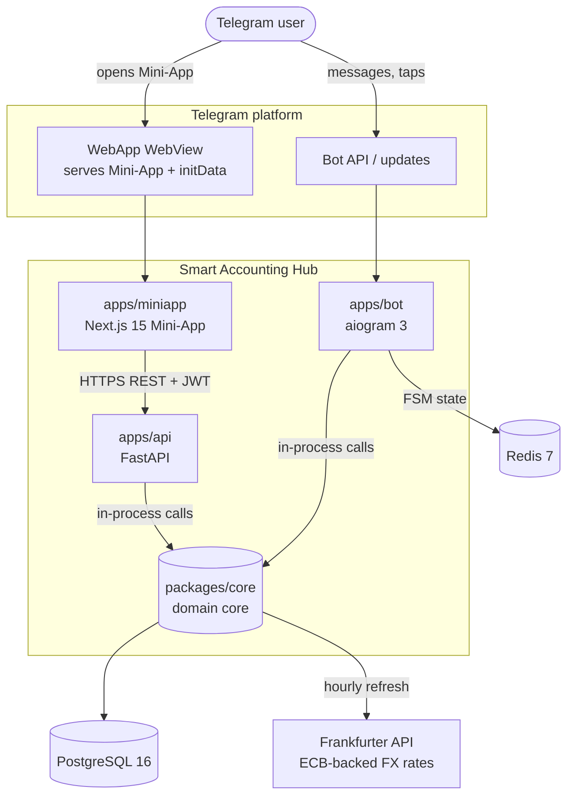
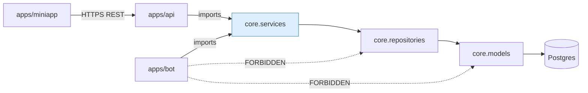
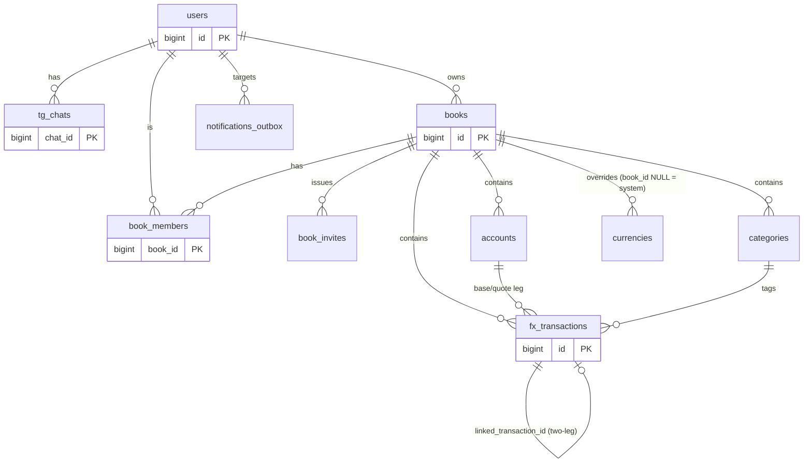
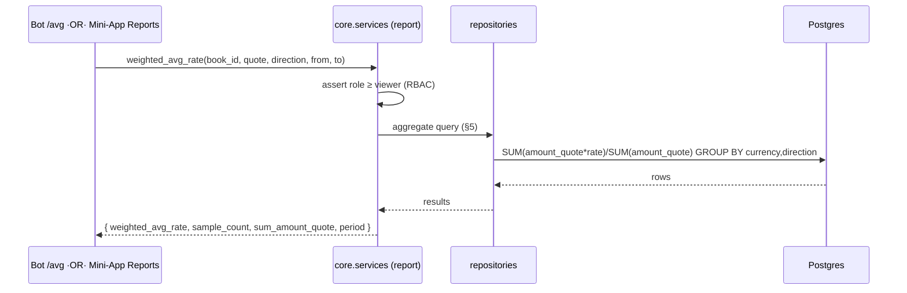
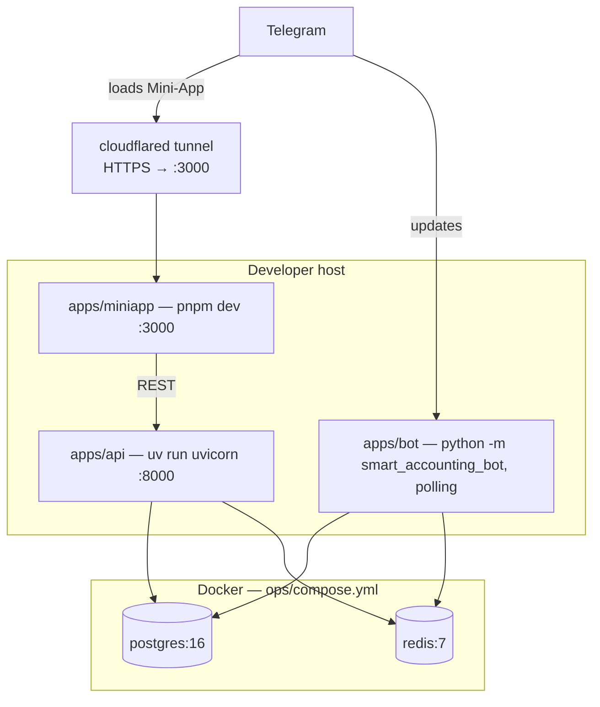

# Smart Accounting Hub — System Design

> **Status:** design-of-record · **Last updated:** 2026-06-16 · **Git commit:** `28a1d16` · **Branch:** `main`
>
> This document describes **what we are building and why** — the architecture, components, data
> flow, and feature model — as locked in decisions **D1–D32**. It is a synthesis of the design and
> planning docs under `thoughts/shared/`, grounded against the current scaffold. The codebase is
> **pre-implementation**: every `.py`/`.ts` file is a comment-only stub today (see
> [§13 Implementation status](#13-implementation-status)), so this is the intended design, not a
> description of running code.
>
> **Source of truth for decisions** (do not contradict without updating them):
> - [thoughts/shared/research/2026-04-23-yakov-bot-reference-analysis-and-smart-accounting-design.md](../thoughts/shared/research/2026-04-23-yakov-bot-reference-analysis-and-smart-accounting-design.md) — D1–D10
> - [thoughts/shared/research/2026-05-01-deep-dive-finwave-and-aiogram-template-references.md](../thoughts/shared/research/2026-05-01-deep-dive-finwave-and-aiogram-template-references.md) — adopted patterns
> - [thoughts/shared/plans/2026-05-01-mvp-scope-and-milestones.md](../thoughts/shared/plans/2026-05-01-mvp-scope-and-milestones.md) — D11–D32, milestones M1–M5

---

## Table of contents

1. [What we're building](#1-what-were-building)
2. [System context](#2-system-context)
3. [Component architecture](#3-component-architecture)
4. [Domain model & multi-tenancy](#4-domain-model--multi-tenancy)
5. [The headline feature: weighted-average FX rate](#5-the-headline-feature-weighted-average-fx-rate)
6. [Key flows](#6-key-flows)
7. [Cross-cutting concerns](#7-cross-cutting-concerns)
8. [FX rate sourcing](#8-fx-rate-sourcing)
9. [Adopted patterns & provenance](#9-adopted-patterns--provenance)
10. [Feature model by milestone](#10-feature-model-by-milestone)
11. [Runtime & deployment topology](#11-runtime--deployment-topology)
12. [Tech stack & decision index](#12-tech-stack--decision-index)
13. [Implementation status](#13-implementation-status)
14. [Open questions](#14-open-questions)

---

## 1. What we're building

Smart Accounting Hub is a **Telegram-Mini-App-driven FX accounting tool** for individuals, families,
and small businesses who hold and trade across multiple currencies (fiat + crypto). Users record
currency trades ("bought 1000 USD for RUB at 90.0") and the system answers the one question that
generic budgeting apps don't: **"what is my weighted-average rate per currency, by direction, over
this period?"** (the headline feature; D16).

What makes it distinct (confirmed first-to-OSS in the FinWave deep-dive):

- **Weighted-average FX rate** as the headline report — `Σ(amountᵢ·rateᵢ) / Σ(amountᵢ)`.
- **Book-scoped multi-tenancy** — accounts/transactions/categories belong to a *book*; users join
  books with owner/admin/editor/viewer roles (D2).
- **Telegram Mini-App `initData` auth** — no passwords; identity flows from Telegram (D12).
- **Two front-ends, one domain core** — an aiogram bot (conversational entry) and a Next.js
  Mini-App (rich dashboards), both backed by the same Python domain package.

**Scope (locked 2026-05-04):** local-dev MVP, milestones **M1–M4**; M5 (deploy/CI/backups/Sentry)
is **deferred**.

---

## 2. System context

Actors and external systems, and how data crosses the boundary.



**Boundary notes**

- The **Mini-App talks to the API over HTTPS** (REST + Bearer JWT). In local dev it is exposed to
  Telegram through a Cloudflared tunnel over `localhost:3000`.
- The **bot does not call the API over HTTP.** It calls `smart_accounting.services.*` in-process
  (D22). This is a hard architectural rule, CI-enforced (see [§3](#3-component-architecture)).
- **PostgreSQL** is the single system of record. **Redis** holds only aiogram FSM state at MVP
  (no cache/pub-sub yet).
- **Frankfurter** (free, no API key, ECB-backed) is the only external FX source at MVP; the schema
  leaves room for more sources later.

---

## 3. Component architecture

A polyglot **Turborepo + uv monorepo**: deployables in `apps/`, shared libraries in `packages/`.

```
smart-accounting-hub/
├── apps/
│   ├── api/        FastAPI HTTP surface for the Mini-App        (Python, uv member)
│   ├── bot/        aiogram 3 Telegram bot                       (Python, uv member)
│   └── miniapp/    Next.js 15 Telegram Mini-App                 (TS, pnpm workspace)
├── packages/
│   ├── core/       Domain core — models, repos, services, auth, fx, i18n
│   │               (Python dist "smart-accounting", import name `smart_accounting`)
│   └── api-types/  Generated OpenAPI TS types + Money helpers   (@smart-accounting/api-types)
├── migrations/     Alembic (async env.py; versions/ empty pending M1)
└── ops/            compose.yml (Postgres + Redis for local dev)
```

> Naming note: `packages/core` and `packages/api-types` were renamed from `shared_py`/`shared_ts`
> on 2026-06-10; the Python **import name `smart_accounting` is unchanged**. See
> [thoughts/shared/research/2026-06-10-workspace-architecture-and-naming.md](../thoughts/shared/research/2026-06-10-workspace-architecture-and-naming.md).

### 3.1 The dependency rule

`packages/core` is the **single source of business logic and persistence**. Both apps depend on it;
nothing in core imports an app.



- **`apps/bot` may import `smart_accounting.services.*` only** — never `.models` or
  `.repositories` (D22). A CI grep-guard rejects violating imports. Rationale: the bot is a
  presentation surface; RBAC/audit/business rules are single-sourced in services.
- **`apps/api`** is equally thin: routers translate HTTP ⇄ service calls and enforce auth via
  FastAPI `Depends`; no business rules live in routers.

### 3.2 `packages/core` internal layering

| Layer | Path (under `src/smart_accounting/`) | Responsibility |
|---|---|---|
| Config | `config.py` | pydantic-settings singleton, env-driven (`get_config()`) |
| DI | `ioc.py` | Dishka providers (UoW, sessionmaker, httpx, FX client, repos, services, JWT codec) |
| Models | `models/` | SQLAlchemy 2.x ORM — the 11 tables + `base.py`/`fields.py` |
| Repositories | `repositories/` | Async data access; stateless, don't own transactions |
| Services | `services/` | Use-cases, transaction boundaries, RBAC, audit — **the public boundary** |
| Auth | `auth/` | `initdata.py` (HMAC verify), `jwt.py` (HS256), `rbac.py` (role→permission matrix) |
| FX | `fx/` | `clients.py` (FrankfurterClient + `FxClient` protocol), `refresh.py` (hourly loop) |
| Schemas | `schemas/` | Pydantic wire contracts; `money.py` = Decimal-as-string (D23) |
| i18n | `i18n/{en,ru}/` | Fluent bundles for the bot |
| Plumbing | `common/uow.py`, `database/engine.py`, `data/currencies_seed.py` | UoW, engine/sessionmaker, seed data |

The **Unit-of-Work** wraps an `AsyncSession`; Dishka injects a request-scoped UoW. Services compose
repositories inside one UoW boundary and decide commit/rollback.

### 3.3 App wiring

- **`apps/api`** — `main.py` builds the FastAPI app, attaches the Dishka container
  (`dishka.integrations.fastapi.setup_dishka` — must be added ourselves; the template only wires
  aiogram), mounts routers, adds CORS for the Telegram origin, and starts the **FX refresh asyncio
  task in the lifespan**. `deps.py` provides `current_jwt_claims()`, `current_user()`,
  `current_book_member()`, and a `require(permission)` factory.
- **`apps/bot`** — `__main__.py` boots polling (dev) via the AiogramBotTemplate sequence:
  build Dishka container → `setup_dishka(container, dp)` → include routers → `register_dialogs` →
  `setup_dialogs(dp)` → `start_polling`. Redis is the FSM store
  (`DefaultKeyBuilder(with_destiny=True)` so aiogram-dialog and plain FSM coexist). Bot middlewares:
  structlog binding → user loader → active-book resolver → RBAC → Fluent localization.
- **`apps/miniapp`** — Next.js App Router. `lib/api-client.ts` is a typed fetch wrapper (types from
  `@smart-accounting/api-types`) that injects the Bearer JWT and handles `401` by re-authenticating
  transparently; `lib/telegram.ts` wraps the WebApp SDK (initData + focus re-auth).

---

## 4. Domain model & multi-tenancy

### 4.1 Book-scoped multi-tenancy

A **book** is the unit of ownership. Accounts, transactions, categories, tags, members, and invites
are all `book_id`-scoped from the first migration (no "v1 single-user → v2 multi-user" migration
debt). `books.kind ∈ {personal, family, business}` (D2). A user has a `default_book_id`/active book
so the bot and Mini-App land them in their last context.

**Role matrix (D2)** — enforced in `core.auth.rbac` and surfaced as API `Depends` + bot middleware:

| Role | View | Create txn | Edit/del txn | Manage accounts/categories | Invite | Delete book |
|---|---|---|---|---|---|---|
| owner (0)  | ✅ | ✅ | ✅ | ✅ | ✅ | ✅ |
| admin (1)  | ✅ | ✅ | ✅ | ✅ | ✅ | ❌ |
| editor (2) | ✅ | ✅ | ✅ (own) | ❌ | ❌ | ❌ |
| viewer (3) | ✅ | ❌ | ❌ | ❌ | ❌ | ❌ |

Invites are single-use magic-links (`book_invites.token`, deep-linked as
`https://t.me/<bot>?start=invite_<token>`); default invited role is **editor** (D26); owner can't be
invited.

### 4.2 Entity-relationship overview

The initial migration (`0001_initial`) creates **11 tables** plus the `ltree` and `pgcrypto`
extensions and two enum types (`transaction_kind`, `transaction_direction`).



**Table reference** (key columns; all money is `NUMERIC(20,8)`):

| # | Table | Purpose & notable columns |
|---|---|---|
| 1 | `users` | PK `id`; `telegram_user_id` UNIQUE; `language` (en/ru), `timezone`, `is_blocked` |
| 2 | `tg_chats` | PK `chat_id`; `user_id`, `active_book_id` (NULL ⇒ onboarding), `last_message_id` (rolling-message UX), `ui_mode`, `gpt_mode`, `hide_amounts` (D15) |
| 3 | `books` | PK `id`; `owner_id`, `name`, `kind` (0/1/2), `base_currency_code`, `default_language`, `archived` |
| 4 | `book_members` | PK `(book_id, user_id)`; `role` (0–3), `invited_at`, `accepted_at` |
| 5 | `book_invites` | `token` UNIQUE, `role`, `expires_at`, `used_at`; hard-deleted when expired |
| 6 | `currencies` | `book_id` NULL ⇒ system catalogue; `code`, `symbol`, `decimals`, `kind` (fiat/crypto/metal); UNIQUE `(book_id, code)` |
| 7 | `accounts` | `book_id`; `currency_code`, `name`, `kind` (cash/bank/card/brokerage/other), `opening_balance`; balance computed from txns |
| 8 | `categories` | `book_id`; `parents_tree LTREE`; `kind`; GIST index `(book_id, parents_tree)`; cascade-reparent (D14) |
| 9 | `exchange_rates` | external rates: `base`, `quote`, `rate`, `source`, `fetched_at`; **informational only**, TTL 90d |
| 10 | `fx_transactions` | **headline table** — see below |
| 11 | `notifications_outbox` | `user_id`, `book_id`, `kind`, `payload JSONB`, `delivered_at`, `attempts`; outbox pattern, drainer deferred |

**`fx_transactions`** (the aggregatable core): `book_id`, `created_by_user_id`,
`kind` (`plain_cash | internal_transfer | fx_conversion`), `direction` (`buy | sell`),
`base_account_id`/`quote_account_id`, `base_currency_code`/`quote_currency_code`,
`amount_quote`, `rate` (**user-supplied, authoritative — D16**), `amount_base` (= `amount_quote ·
rate`, stored for audit/speed), `fee`/`fee_currency_code`, `occurred_at TIMESTAMPTZ`, `note`,
`source`, `category_id`, `linked_transaction_id` (self-ref for two-leg moves),
`idempotency_key` + `UNIQUE (book_id, idempotency_key)` (D28), `archived`.
Indexes include `(book_id, quote_currency_code, direction, occurred_at DESC)` — the covering index
for the weighted-average query.

> **Semantics example:** "Bought 1000 USD for RUB at 90.0" → base = RUB (money left),
> quote = USD (money arrived), `amount_quote = 1000`, `rate = 90.0`, `amount_base = 90000`.

### 4.3 Money representation (D23 / Q5)

One rule, three representations:

```
Postgres NUMERIC(20,8)  ⇄  Python Decimal  ⇄  JSON string ("90.27272700")  ⇄  JS big.js
```

- Never `FLOAT`. The Pydantic `Money` type
  (`Annotated[Decimal, BeforeValidator, PlainSerializer(format(v,'f'))]`) lives in
  `core/schemas/money.py` and serializes to a full-precision **string** on the wire.
- The Mini-App does arithmetic with **big.js** on those strings; `Number()` only for display.
- Rationale: floats lose precision past ~15 digits; cents-as-int breaks on mixed decimals
  (BTC=8, USD=2).

---

## 5. The headline feature: weighted-average FX rate

**Definition.** For N transactions in a currency with amount `aᵢ` and rate `rᵢ`:

```
weighted_avg_rate = Σ(aᵢ · rᵢ) / Σ(aᵢ)
```

computed **per quote currency and per direction**, with optional date-range (and later
account/tag/category) filters.

**Authority (D16).** The user-supplied `rate` on each row is the source of truth. The persisted
triple `(amount_quote, rate, amount_base)` is authoritative; the system's `exchange_rates` value is
**informational only** and shown as a delta in the UI. We never hide user-entered data behind a
computed system rate — that would be an audit nightmare for a finance tool.

**Computation.** Not stored/precomputed — derived on demand by an indexed aggregate:

```sql
SELECT quote_currency_code AS currency,
       direction,
       SUM(amount_quote)                            AS total_amount,
       SUM(amount_quote * rate) / SUM(amount_quote) AS weighted_avg_rate
FROM fx_transactions
WHERE book_id = $1
  AND ($2::timestamptz IS NULL OR occurred_at >= $2)
  AND ($3::timestamptz IS NULL OR occurred_at <  $3)
GROUP BY quote_currency_code, direction
ORDER BY quote_currency_code, direction;
```

The covering index `(book_id, quote_currency_code, direction, occurred_at DESC)` makes this a single
indexed aggregate, fast enough for interactive use. If volumes grow, the design allows a daily
materialized view `mv_daily_fx_avg`.

**Authorization** is enforced before the query runs: the API resolves `book_id` from the JWT claim
and verifies a `book_members` row with role ≥ viewer.

**Surfaces** (ship together at M3):
- API — `GET /books/{book_id}/reports/weighted-avg-rate?quote=USD&direction=sell&from=…&to=…`
  → `{weighted_avg_rate, sample_count, sum_amount_quote, period, …}`
- Bot — `/avg` quick flow (Direction → QuoteCurrency → DateRange → inline result)
- Mini-App — **Reports** tab: large weighted-avg number + Recharts line chart of individual trade
  rates against the average line.

**Acceptance check (from the plan):** sell 1000 USD @ 90.0 and 10000 USD @ 90.3 ⇒
`/avg sell USD all` prints **₽90.272727** over 2 trades / $11,000, and the Mini-App shows the same.

---

## 6. Key flows

### 6.1 Mini-App authentication (initData → JWT, D12)

```mermaid
sequenceDiagram
    participant U as User (Telegram)
    participant M as Mini-App
    participant A as apps/api
    participant C as core (auth + services)
    participant DB as Postgres

    U->>M: opens Mini-App
    M->>A: POST /auth/telegram { init_data }
    A->>C: verify_init_data(init_data, BOT_TOKEN)
    Note right of C: HMAC-SHA256 of data_check_string<br/>+ auth_date freshness (≤24h)
    C->>DB: upsert user; if new → create book + owner membership
    C-->>A: user, book
    A->>A: mint HS256 JWT {sub, book_id, role, exp, iat, jti}, 30 min
    A-->>M: { access_token, expires_in: 1800, user, book }
    M->>A: GET /me  (Authorization: Bearer …)
    A-->>M: { user, active_book, role, books[] }
```

**Refresh (D27):** the client re-authenticates **reactively on 401** (re-posts fresh initData,
retries the original request) and **proactively on WebApp focus** when the JWT is within 5 min of
expiry. No refresh-token endpoint at v1.0.

### 6.2 Recording a trade (bot)

The bot drives a single rolling message (FinWave-style; `tg_chats.last_message_id` +
`bot.edit_message_text`). `RecordTradeDialog` (aiogram-dialog): Direction → BaseCurrency (defaults to
`book.base_currency`) → QuoteCurrency → BaseAccount → QuoteAccount → AmountQuote → Rate (current
Frankfurter rate offered as a hint) → OccurredAt (default now) → Note → **Confirm**. On confirm the
handler calls `smart_accounting.services.transaction_service.record()` — which computes
`amount_base = amount_quote · rate`, applies RBAC, mints/honours the idempotency key, and commits in
one UoW. The same service backs the Mini-App's trade form.

### 6.3 Weighted-average report



### 6.4 FX refresh loop

An asyncio task started in the **API lifespan** calls `FrankfurterClient.fetch_latest(base='USD')`
hourly and inserts `exchange_rates` rows (`source='frankfurter'`, `fetched_at=now()`), logging and
swallowing transient errors. It migrates to an `arq` worker in v1.1 when rate alerts / recurring
transactions arrive.

### 6.5 Invite & join

`POST /books/{id}/invites` (admin+) mints a `token` + deep link. The invitee taps
`t.me/<bot>?start=invite_<token>`; `/start invite_<token>` validates the token, prompts "Join
'<book>' as Editor?", and on accept calls `invite_service.accept()` (idempotent), creating the
membership and switching the active book.

---

## 7. Cross-cutting concerns

| Concern | Design | Decision |
|---|---|---|
| **Error model** | API returns `{error: {code, params}, request_id}`; HTTP status carries severity. Codes are `UPPER_SNAKE`, namespaced `AUTH_/BOOK_/TX_/FX_/RBAC_/RATE_`. `params` are typed values for Fluent interpolation. | D13, D24 |
| **i18n** | Backend is **i18n-agnostic** (codes only). Bot localizes via aiogram-i18n + Fluent (`core/i18n/{en,ru}/main.ftl`); Mini-App via `@fluent/bundle` (`miniapp/src/i18n/{en,ru}`). EN+RU; EN through M3, full RU pass in M4. CI guards against hardcoded Cyrillic in `apps/bot`. | D3, D13 |
| **Auth** | initData HMAC verify (≤24h freshness) → HS256 JWT, 30-min, claims `{sub, book_id, role, exp, iat, jti}`. `book_id`+`role` in-claim means most endpoints skip a `book_members` re-query. Mini-App tokens are `limited` (can't rotate/revoke). | D12 |
| **Idempotency** | `POST /transactions` carries an `idempotency_key` (fresh UUID per Confirm tap); repeat returns the existing row (`200`, `Idempotent-Replayed: true`). Guards Telegram update redelivery. | D28 |
| **Pagination** | Cursor-based, no totals: `?cursor=&page_size=50` (max 100) → `{items, next_cursor, has_more}`. Cursor is a signed base64 `(occurred_at DESC, id)` for txns. | D25 |
| **Soft-delete** | `archived BOOLEAN` on books/accounts/categories/currencies/fx_transactions; lists filter `WHERE NOT archived`. Hard-delete only for invites (expired), exchange_rates (90d TTL), outbox (30d post-delivery). | D29 |
| **Timezones** | All timestamps `TIMESTAMPTZ` (UTC). Report period boundaries computed in the user's IANA timezone client-side, converted to UTC for `from/to` params; report endpoints are timezone-agnostic. | D32 |
| **Logging** | Local-dev MVP uses stdlib `logging` at DEBUG. structlog + Sentry are **deferred** (return with deployment). | D17 (deferred) |

---

## 8. FX rate sourcing

- **MVP provider: Frankfurter** (`https://api.frankfurter.dev`) — free, no API key, ECB-backed,
  ~150 fiat codes. Accessed via an `httpx.AsyncClient` injected by Dishka, behind an `FxClient`
  protocol (`fetch_latest(base) -> dict[str, Decimal]`).
- **Pluggable by design:** the `source` column on `exchange_rates` already enumerates
  `frankfurter | ecb | openexchangerates | coingecko | nbu | privat24 | binance`. v1.1+ adds
  CoinGecko (crypto), OXR, ECB-direct clients behind the same protocol. Scrapers (if ever) sit
  behind the same interface so they can be swapped.
- **Role:** rates are **informational** — shown as a delta against the user's authoritative trade
  rate (D16). They never feed the weighted-average.

---

## 9. Adopted patterns & provenance

From the FinWave + AiogramBotTemplate deep-dive. **Patterns adopted, code mostly not ported.**

| Pattern | From | How we use it |
|---|---|---|
| **ltree hierarchical categories** | FinWave | `categories.parents_tree LTREE` + GIST index; cascade-reparent (D14); `sqlalchemy_utils.LtreeType` |
| **Polymorphic transactions** | FinWave (simplified) | one `fx_transactions` table + `kind` enum + self-ref `linked_transaction_id` (vs FinWave's metadata sub-tables) |
| **Notification outbox** | FinWave (one table) | `notifications_outbox`; soft-delete on delivery; drainer deferred to v1.1 + WebSocket push |
| **DB-stored bearer tokens / `limited` flag** | FinWave | validates the JWT design; Mini-App tokens are `limited=true` |
| **Single rolling message UX** | FinWave-TG-Bot | `tg_chats.last_message_id` + `edit_message_text` |
| **WebSocket push channel** | FinWave-TG-Bot | for rate alerts; deferred past MVP |
| **AiogramBotTemplate cherry-pick (~12 files)** | AiogramBotTemplate (MIT) | `Base`/`fields`, async Alembic `env.py`, `alembic.ini`, engine, UoW, Dishka provider, entrypoint/boot sequence, Redis FSM storage, pydantic-settings shape — copied near-verbatim, package renamed to `smart_accounting`, credited in `THIRD_PARTY_NOTICES.md` |

**Rejected:** FinWave's manual session-paste auth and `?autologin=` deep-link (we use initData +
short-lived JWT), hardcoded RU strings, blocking calls in async handlers, single shared DB
connection, Spark-style hand-rolled HTTP (FastAPI gives typed routes + OpenAPI for free).

**Critical integration note:** the template wires Dishka into aiogram only — we add
`dishka.integrations.fastapi.setup_dishka` ourselves so API routes can inject the UoW.

---

## 10. Feature model by milestone

Two-week milestones; **weighted-average headline ships at the end of M3.** M5 is deferred.

| Milestone | Theme | Ships | API | Bot | Mini-App |
|---|---|---|---|---|---|
| **M1** | Foundations & auth path | monorepo bootstrap, 12 cherry-picked files, `0001_initial` (11 tables), end-to-end initData→JWT | `/healthz`, `POST /auth/telegram`, `GET /me` | `/start` (auto-create user+book+owner) | single page "Hello {name}, book {name}" |
| **M2** | Books, invites, accounts, currencies | RBAC layer, currency seed (`0002`), per-book accounts | books CRUD + `/switch`, invites, currencies, accounts CRUD | CreateBook / JoinInvite / CreateAccount / BookPicker dialogs, `/books`, `/lang` | book picker, Accounts tab, Invites section |
| **M3** | **FX transactions + weighted-average** | FrankfurterClient + refresh loop, `TransactionService`, weighted-avg query | transactions CRUD, **`/reports/weighted-avg-rate`** | RecordTradeDialog, **`/avg`** | **Trades** tab (DataTable), **Reports** tab (number + Recharts) |
| **M4** | Categories, charts, EN/RU, polish | ltree categories + cascade, internal transfers, CSV export, full RU pass | categories CRUD, `/transfers`, `export.csv` | category picker widget, InternalTransferDialog | Categories tree, balance/P&L charts, CSV download |
| **M5** | Hardening, ops, release | **DEFERRED** (2026-05-04): deploy, CI/CD, backups, Sentry, security pass, docs, v1.0.0 | — | — | — |

---

## 11. Runtime & deployment topology

### 11.1 Local-dev MVP (current target)



- **Apps run on the host** (`uv run` / `pnpm dev`, hot-reload); **only Postgres + Redis run in
  Docker** (`ops/compose.yml`, both healthchecked). Cloudflared exposes `localhost:3000` over HTTPS
  so Telegram can load the Mini-App.
- Postgres password is a Docker secret (`db/password.txt`); everything else
  (`BOT_TOKEN`, `JWT_SECRET`, FX keys) lives in `.env` (chmod 600, gitignored) — D20.
- Quality gate is **`make check`** run by hand (CI deferred — D19).

### 11.2 Production (designed, deferred to M5)

Single VM, **one Docker image with two CMDs** (`apps/api` runs uvicorn; `apps/bot` runs the bot in
webhook mode), plus `postgres`, `redis`, and **Caddy** terminating TLS with auto–Let's Encrypt and
reverse-proxying the API (D11). Backups (pg_dump + restic → B2, D18), Sentry (D17), and GitHub
Actions CI (D19) all return with M5.

---

## 12. Tech stack & decision index

**Backend:** Python 3.12 · aiogram 3.x · aiogram-dialog · FastAPI · SQLAlchemy 2.x async · asyncpg ·
PostgreSQL 16 (ltree, pgcrypto) · Redis 7 · Alembic · Dishka · pydantic-settings · httpx · pyjwt ·
Fluent. Managed by **uv** workspace; lint/format **ruff**, types **mypy --strict**, tests **pytest**.

**Frontend:** Next.js 15 (App Router) · TypeScript · TanStack Query v5 · shadcn/ui · Tailwind ·
Recharts · `@telegram-apps/sdk-react` · big.js · `@fluent/bundle`. Managed by **pnpm + Turborepo**;
lint **oxlint** (no ESLint, D31), format **Prettier**. Types generated by **openapi-typescript**
(`pnpm types:gen`).

**Locked decisions** (full text in the source docs):

| Range | Topic | Where |
|---|---|---|
| D1–D10 | Reference scope, audience, languages, market, stack, repo, deploy | [2026-04-23 design doc](../thoughts/shared/research/2026-04-23-yakov-bot-reference-analysis-and-smart-accounting-design.md) §0.3 |
| D11–D20 | Caddy, JWT, error model, ltree cascade, tg_chats, rate authority, (D17–D19 **deferred**), secrets | [MVP plan](../thoughts/shared/plans/2026-05-01-mvp-scope-and-milestones.md) §0 |
| D21–D32 | Auto-create on /start, bot→services rule, money-as-string, error envelope, pagination, invite role, JWT refresh, idempotency, soft-delete, public OpenAPI, oxlint, report timezones | [MVP plan](../thoughts/shared/plans/2026-05-01-mvp-scope-and-milestones.md) §0.1 |

---

## 13. Implementation status

As of `28a1d16` (2026-06-16): the repository is a **pre-implementation scaffold**.

- All **59 `.py` files** across `apps/` + `packages/` + `migrations/` are **comment-only stubs**
  (each carries a detailed header describing intended behavior — the basis for much of this doc).
- `migrations/versions/` holds only `.gitkeep` — no migration written yet.
- Real content lives only in **config/manifests** (`pyproject.toml`, `package.json`, `turbo.json`,
  `alembic.ini`, `ops/compose.yml`, `Makefile`) and **docs/**.
- `ops/compose.yml` defines only `db` + `redis`. No Dockerfile or Caddyfile in-repo (production is
  deferred).
- One commit exists (`28a1d16 Create README.md`); the scaffold is otherwise untracked.

Detail: [thoughts/shared/research/2026-06-10-current-implementation-state.md](../thoughts/shared/research/2026-06-10-current-implementation-state.md).
**Next action per plan §1:** cherry-pick the 12 AiogramBotTemplate files, then write `0001_initial`.

---

## 14. Open questions

Carried forward from the source docs (not blocking M1):

- **Cash vs bank granularity** — current model allows multiple accounts per `kind`; finer
  granularity TBD (Q5 in 2026-04-23 doc).
- **Import sources** — CSV-only at MVP; bank connectors are Phase 2 (Q7).
- **P&L-by-currency chart** — stretch in M4; defer to v1.1 if it bloats the milestone.
- **WebSocket push / outbox drainer / arq worker** — designed but deferred to v1.1.
- **Crypto/metal rate sources** (CoinGecko etc.) — schema-ready, post-MVP.

---

### Related documents
- Landscape survey: [2026-04-23-open-source-tg-finance-bot-references.md](../thoughts/shared/research/2026-04-23-open-source-tg-finance-bot-references.md)
- FinWave gaps & adoption: [2026-05-01-deep-dive-finwave-and-aiogram-template-references.md](../thoughts/shared/research/2026-05-01-deep-dive-finwave-and-aiogram-template-references.md)
- Workspace naming: [2026-06-10-workspace-architecture-and-naming.md](../thoughts/shared/research/2026-06-10-workspace-architecture-and-naming.md)
